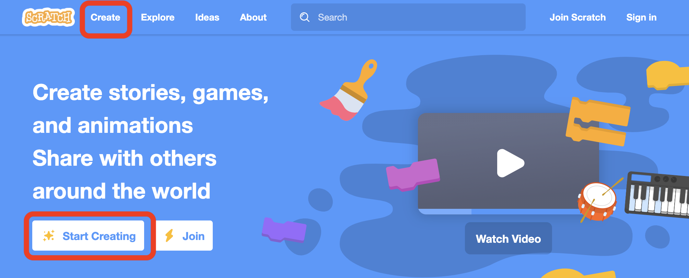
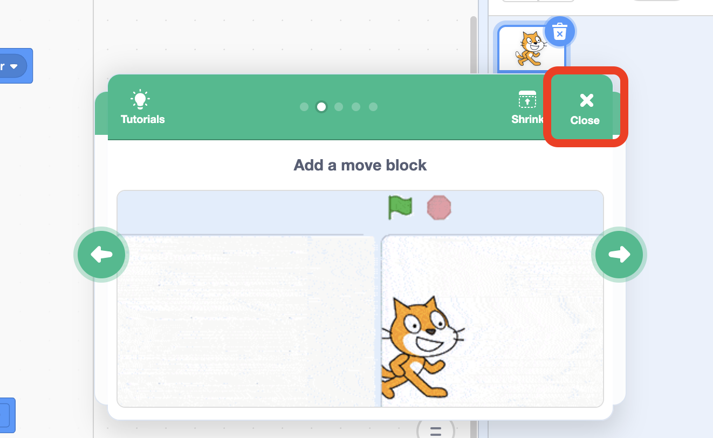
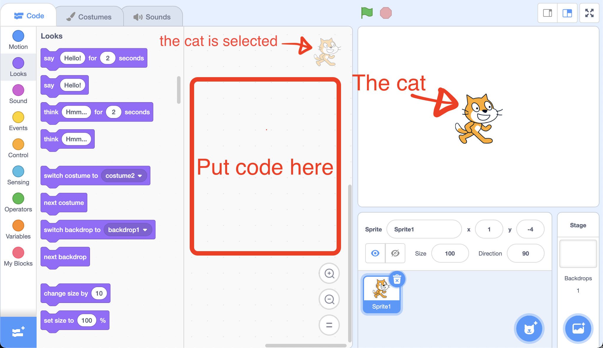
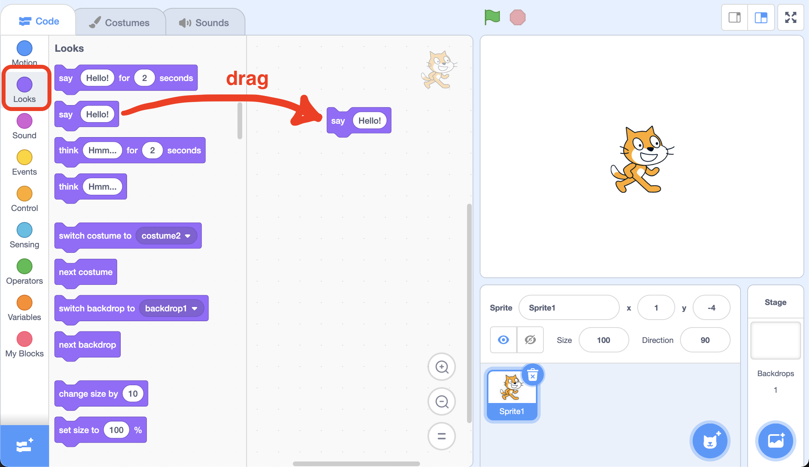
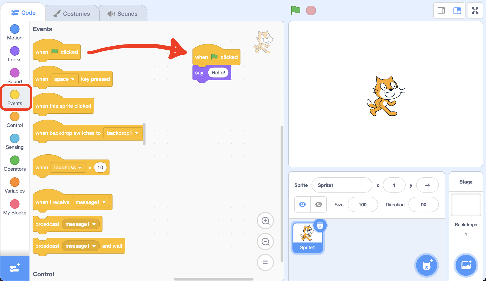
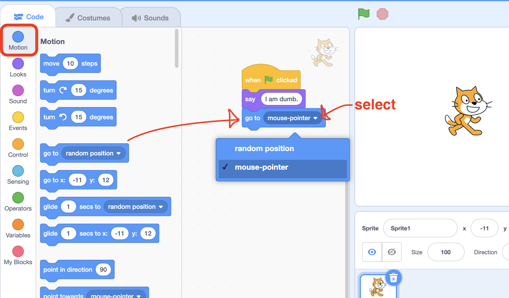
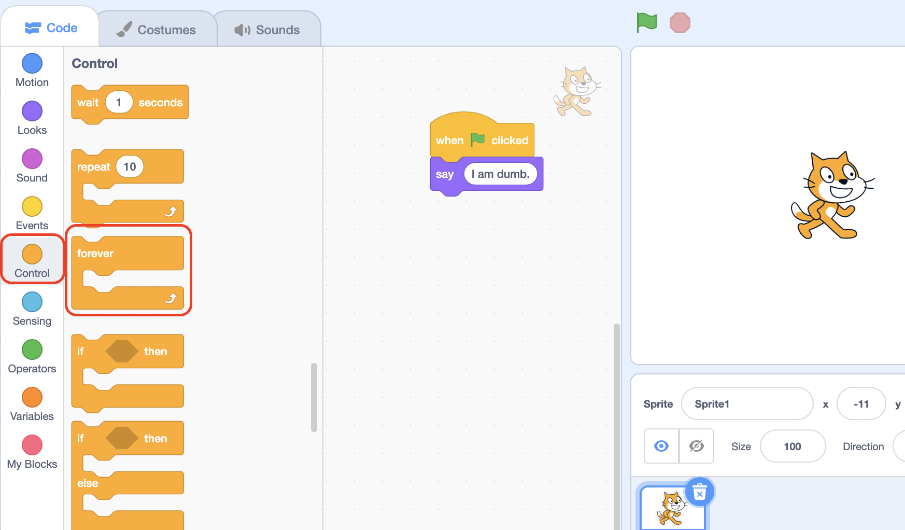
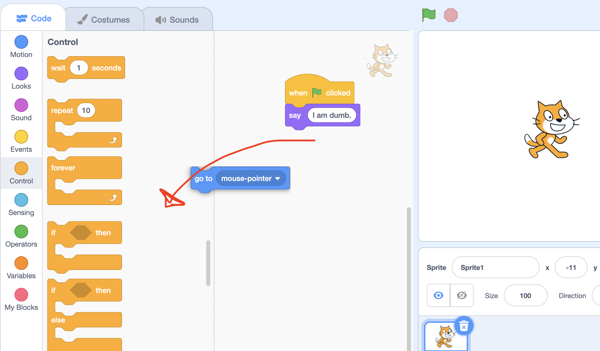
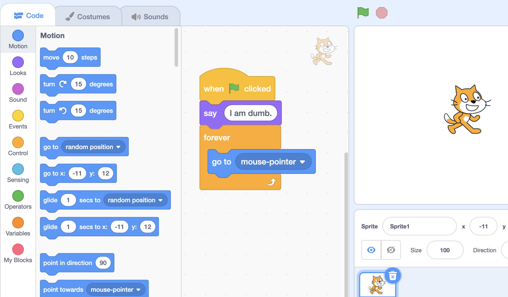

(Originally part of the lecture, but moved to the "Archive" folder of old lectures)

In this tutorial we will make a simple game with a jumping cat!

# Scratch, a puzzle piece language
Lets use a program*ing language (that will be compiled by scratch into another programming language called javascript) to first get the computer to say the word "Hello!" (javascript runs inside of your web browser), then get a cat picture to jump with physics!

We will use a programming language called Scratch, that automatically makes sure we write our programs with correct syntax, because getting used to a programming languages syntax can be... interesting. (remember we need syntax so that the compiler (or interpreter) can figure out how to convert our words into instructions for the computer). 

Scratch runs in your Browser so you don't have to download anything! Just go to [scratch.mit.edu](https://scratch.mit.edu/) and and click on the "Create" or "Start Creating" button.

(see picture below)

You'll notice a tutorial pop up, feel free to follow the tutorial and then keep reading this. Or just close it and keep reading.

Now click on the cat to select it and lets add some code to the cat. 

(remember "code" is another way of saying "instructions")

Scratch doesn't make us type words, instead it gives us puzzle pieces with words on them. Because they are puzzle pieces they only fit together if the "syntax" or code is correct.

(If we were using another programming language we would have to type those words manually and make sure they are following the rules of syntax)

So... yeah, scratch makes it much easier to code since you don't have to worry about "syntax" or miss-typing something. All the possible instructions come as puzzle piece "blocks".

Go to the "looks" tab and drag the code block called "say Hello!" onto the coding area. You can change the word "Hello!" to whatever you want by clicking on it, then typing in the word you want.

To "run" the code click the green flag. You should see the cat say "hello!"...

Wait why didn't the cat say hello!?... The problem is that we didn't tell the computer *when* the `say` block should run. 

Should it always say hello? Should it say hello when we click the green flag?

The last question sounds logical, and, it turns out, scratch gives us a code block called "When green flag clicked"!

Go to the "Events" tab. Drag the "When green flag clicked" block into the code area and attatch the "Say Hello!" block under it.

You'll notice that the code blocks "fit" together. Now if we click the green flag the cat will say "Hello!"!

# Follow the mouse-pointer
We can make the cat follow the mouse. 

Go to the "Motion" tab and simply add the `go to` code block under the `say` block. Then change the `go to` block to go to the "mouse-pointer"... 

If you try this it will work, but not quite how we want it to.

Since the code under the "When green flag clicked" only runs *once* (when the green flag is clicked), the cat would go to the mouse the moment you clicked the green flag, but would not continue to move the cat to follow the "mouse-pointer".

To fix this we need our code to "forever" run some code that says `go to (mouse-pointer)`, over and over again, making the cat follow the mouse pointer.

If you go to the "Control" tab you will find a code block that does just that, its called the `forever` block.

To delete a code block, drag it onto the tab area, this will delete it.

Now add the `forever` block under the `say` block, then inside of the `forever` block put a `go to (mouse-pointer)` block.

# Variables for movement
If we want to simulate gravity we have to do more than follow the mouse pointer, we need to move the cat so that it looks like it is falling.

TODO

to reset the cats position, we can go to its position and change it back to "?????"
An even esaier way is to reset the cats position when the green flag is clicked TODO

to prevent the cat form falling faster and faster, we can add a max falling speed

in physics the max falling speed happens when air pushing against you as you fall prevents you from going faster. This is partially because the faster you go, the more the air will push, so eventually they balance out. We call this balanced velocity, "terminal velocity".

now, it would be cool if the cat stopped falling when it "hit" something. TODO