(Originally part of the lecture, but moved to the "Archive" folder of old lectures)

In this tutorial we will make a simple game with a falling cat!

# Scratch, a puzzle piece language
Lets use a program*ing language called Scratch, that automatically makes sure we write our programs with correct syntax, because getting used to a programming languages syntax can be... interesting. 

(remember we need syntax so that a *compiler* (or interpreter) can figure out how to convert our words into instructions for the computer).

Scratch runs in your Browser so you don't have to download anything! Just go to [scratch.mit.edu](https://scratch.mit.edu/) and and click on the "Create" or "Start Creating" button.

(see picture below)

You'll notice a tutorial pop up, feel free to follow the tutorial and then keep reading this. Or just close it and keep reading.

Now click on the cat to select it and lets add some code to the cat. 

(remember "code" is another way of saying "instructions")

Scratch doesn't make us type words, instead it gives us puzzle pieces with words on them. Because they are puzzle pieces they only fit together if the "syntax" or code is correct.

(If we were using another programming language we would have to type those words manually and make sure they are following the rules of syntax)

So... yeah, scratch makes it much easier to code since you don't have to worry about "syntax" or miss-typing something. All the possible instructions come as puzzle piece "blocks".

Go to the "looks" tab and drag the code block called "say Hello!" onto the coding area. You can change the word "Hello!" to whatever you want by clicking on it, then typing in the word you want.

To "run" the code click the green flag. You should see the cat say "hello!"...

Wait why didn't the cat say hello!?... The problem is that we didn't tell the computer *when* the `say` block should run. 

Should it always say hello? Should it say hello when we click the green flag?

The last question sounds logical, and, it turns out, scratch gives us a code block called "When green flag clicked"!

Go to the "Events" tab. Drag the "When green flag clicked" block into the code area and attatch the "Say Hello!" block under it.

You'll notice that the code blocks "fit" together. Now if we click the green flag the cat will say "Hello!"!

# Follow the mouse-pointer
We can make the cat follow the mouse. 

Go to the "Motion" tab and simply add the `go to` code block under the `say` block. Then change the `go to` block to go to the "mouse-pointer"... 

If you try this it will work, but not quite how we want it to.

Since the code under the "When green flag clicked" only runs one time (when the green flag is clicked) the cat goes to the mouse the moment you clicked the green flag, but it doesn't continue moving the cat to *follow* the mouse pointer.

To fix this we need our code to "forever" run some code that says `go to (mouse-pointer)`, over and over again, making the cat follow the mouse pointer.

If you go to the "Control" tab you will find a code block that does just that, its called the `forever` block.

To delete a code block, drag it onto the tab area, this will delete it.

Now add the `forever` block under the `say` block, then inside of the `forever` block put a `go to (mouse-pointer)` block.

# Gravity
If we want to simulate gravity we have to do more than follow the mouse pointer, we need to move the cat so that it looks like it is falling.

For this we will create a variable (a code-word that references a value (in this case the *value* is a number)). 

That variable will reference a number representing a y-velocity. We will then use that y-velocity number to move the player down. Every `forever` loop, we decrease the y-velocity.

Go to the "Variables" tab. and click "Make a Variable"

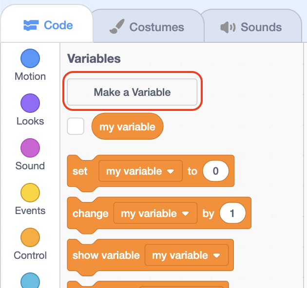

name it "y-velocity". 

Now in the forever loop we can decrease the y-velocity number every `forever` loop.

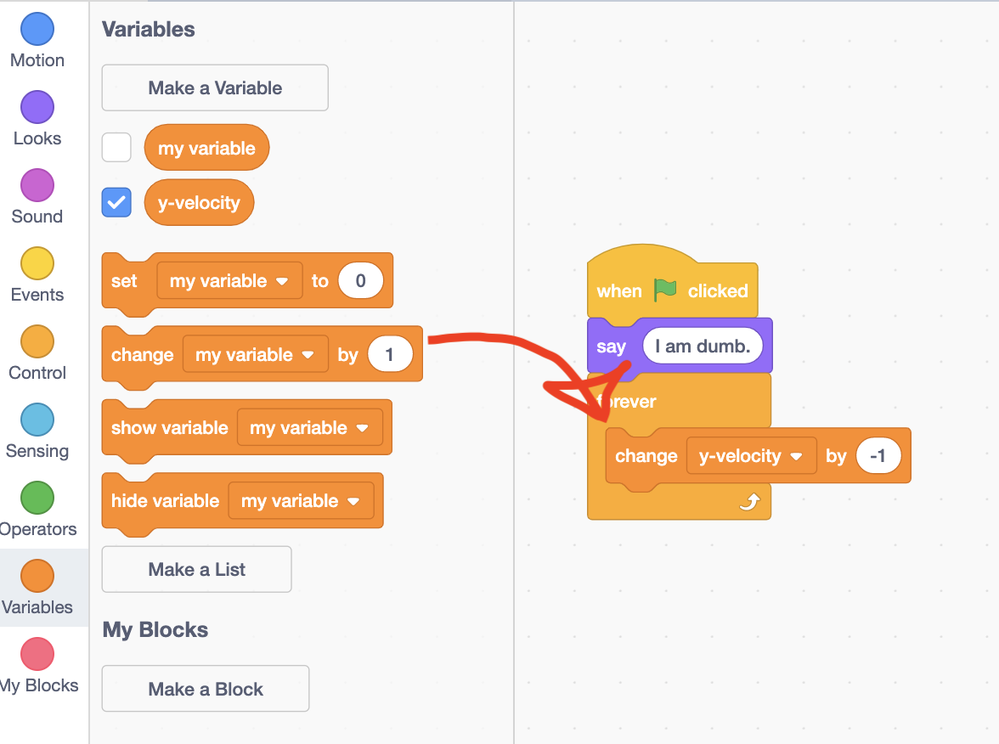

Then go to the "Motion" tab and use the `change y by` block to change the y position of the cat by some number

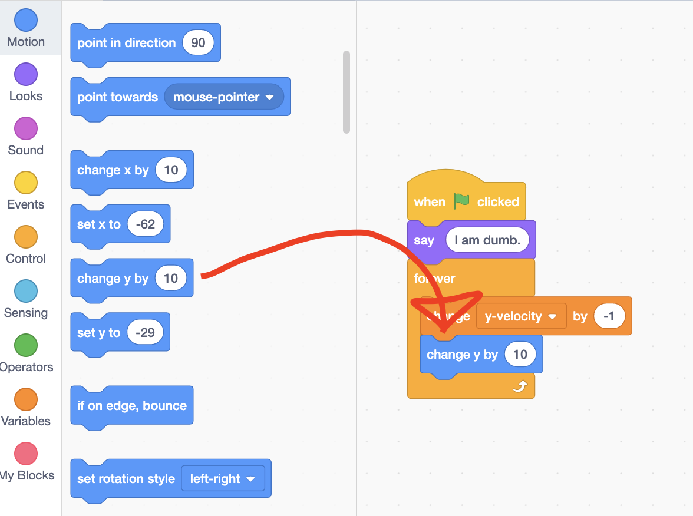

To change the cats position using our `y-velocity` variable, go to the "Variables" tab and drag the `y-velocity` variable onto the `change y by` code block where the number is (`change y by` should adjust to fit the `y-velocity` variable in it).

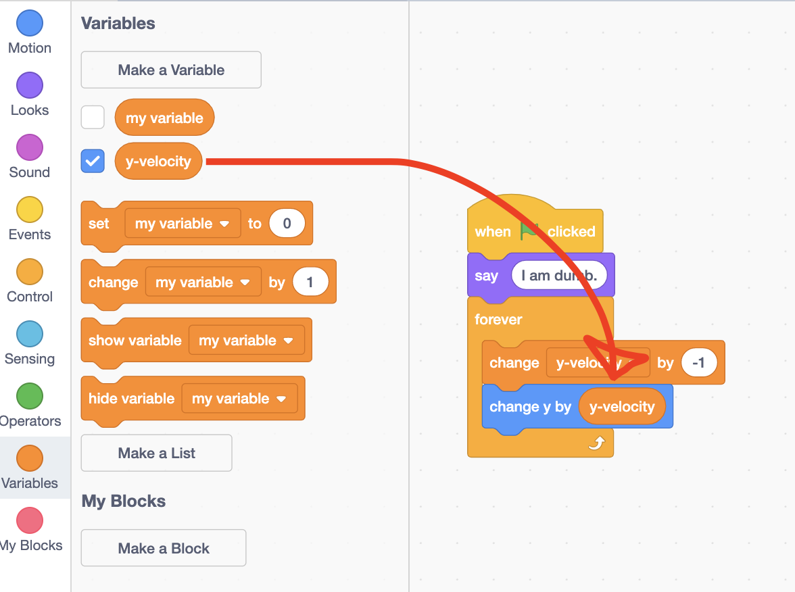

Now tha cat falls! Although it stays stuck at the bottom of the canvas!

We can manually go to its position and change it back to `x(0) y(0)`.

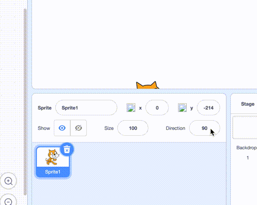

Or we could just click and drag the cat "sprite" to the center of the cavnas. ("sprite" is just another name for a 2D picture)

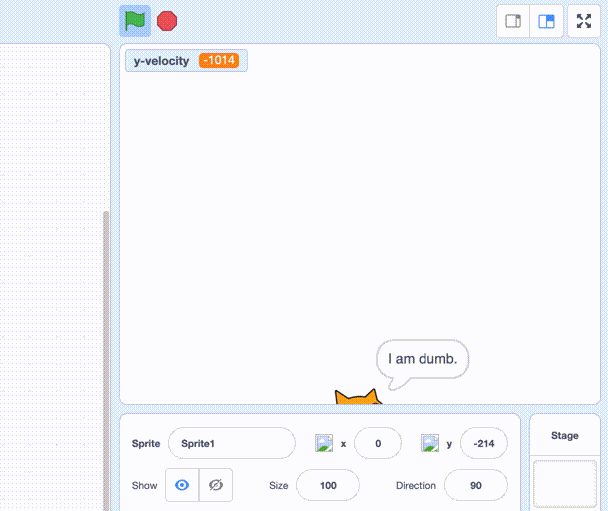

An even easier way is to reset the cats position when the green flag is clicked through a `set x to (0)` and `set y to (0)` block. These blocks set the cats position to whatever you want.

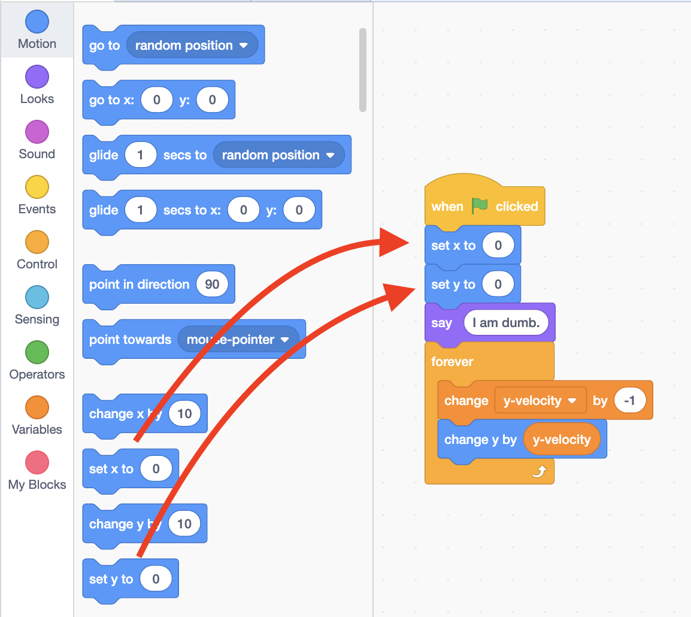

In this case we reset the cats position to the center whenever we click the green flag.

# Collision
It would be cool if the cat stopped falling when it touched the edge. To do this we can use an `if` statement.

Go to the "Control" tab and get the `if < > then else` block and put it inside of the `forever` block.

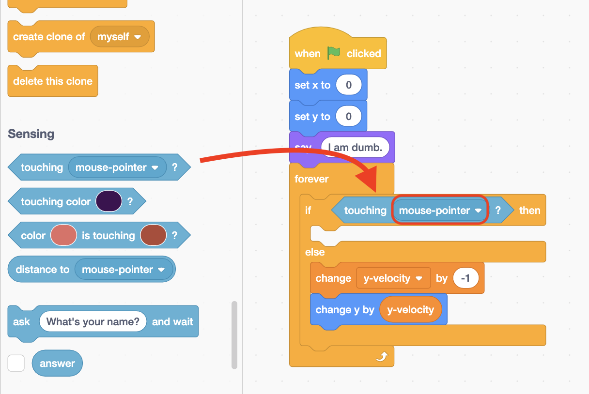

Then from the "Sensing" tab we put the `is touching ()` *conditional* code block. 

(Make sure to change the drop down from `mouse-pointer` to `edge`!)

Now when the cat touches the edge, the code does nothing, but if the cat is NOT touching the edge the cat falls!

You might notice that the y-velocity variable is very big! And as a result we fall VERY fast, and it only gets worse because we never reset `y-velocity`!

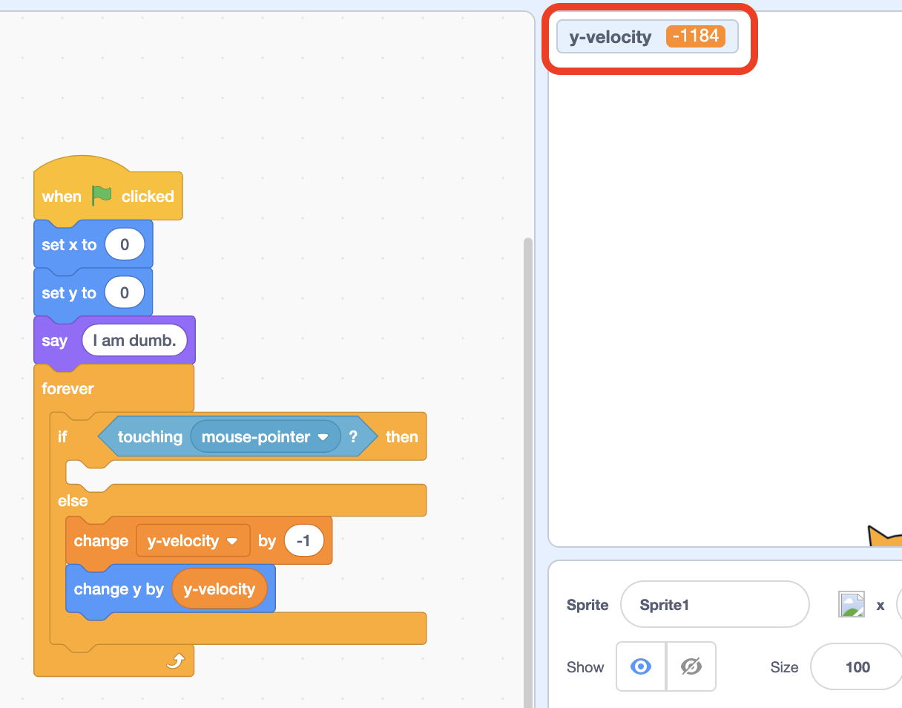

To fix this, whenever the cat touches the edge, we reset the `y-velocity` variable, *if*, the cat touches the edge.

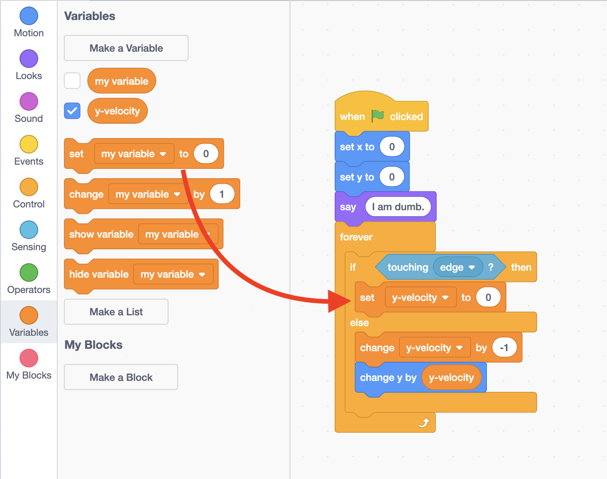

Now we can drag the cat up, and it will slowly fall every time! Yay!

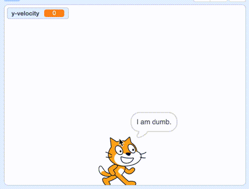

